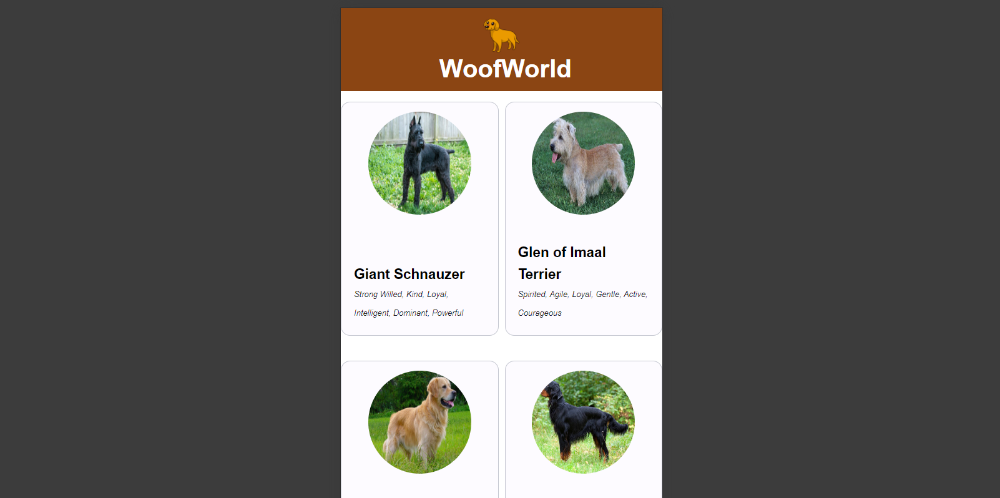
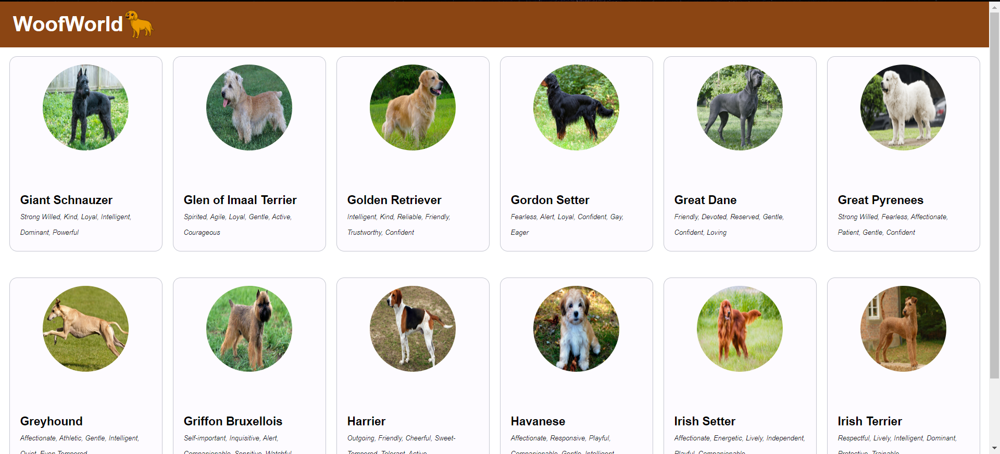

# DogService

## Descrição
DogService é um serviço Angular para buscar informações sobre diferentes raças de cães. Ele utiliza HTTP para se comunicar com uma API e suporta paginação para facilitar a navegação através de uma grande quantidade de dados. Este projeto foi desenvolvido para fornecer uma maneira simples e eficiente de obter dados sobre cães.

## Funcionalidades
Busca de Raças de Cães: Permite buscar informações sobre diferentes raças de cães.
Paginação: Suporta paginação para gerenciar a quantidade de dados retornados em cada requisição.
Siga estas etapas para configurar e executar o projeto localmente.

## Pré-requisitos
Node.js (>= 12.x)
Angular CLI (>= 12.x)

## Passos
Clone o Repositório:
git clone https://github.com/seu-usuario/dogservice.git

## Instale as Dependências:
npm install

## Execute o Projeto:
ng serve

## Acesse o Serviço:
Abra seu navegador e vá para http://localhost:4200.

## Testes
O projeto utiliza Jasmine e Angular TestBed para testes unitários.

## Executar Testes
Para executar os testes, use o comando:
ng test

## Executar coverage
ng test --code-coverage

## Contribuição
Contribuições são bem-vindas! Sinta-se à vontade para abrir uma issue ou enviar um pull request.

## Passos para Contribuir
Fork o repositório.
Crie uma nova branch (git checkout -b feature/nova-feature).
Faça commit das suas alterações (git commit -m 'Adiciona nova feature').
Faça push para a branch (git push origin feature/nova-feature).
Abra um Pull Request.

Contato
Se você tiver alguma dúvida, sinta-se à vontade para entrar em contato:

Nome: Roberta Neres
Email: Robertha07rocha@gmail.com
LinkedIn: https://www.linkedin.com/in/roberta-neres-b09483112/
